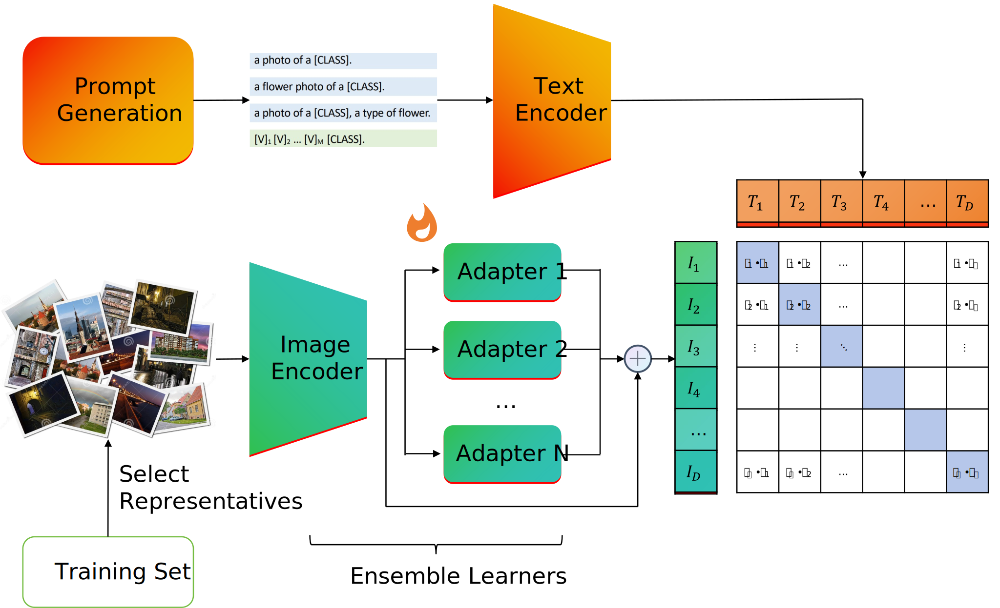
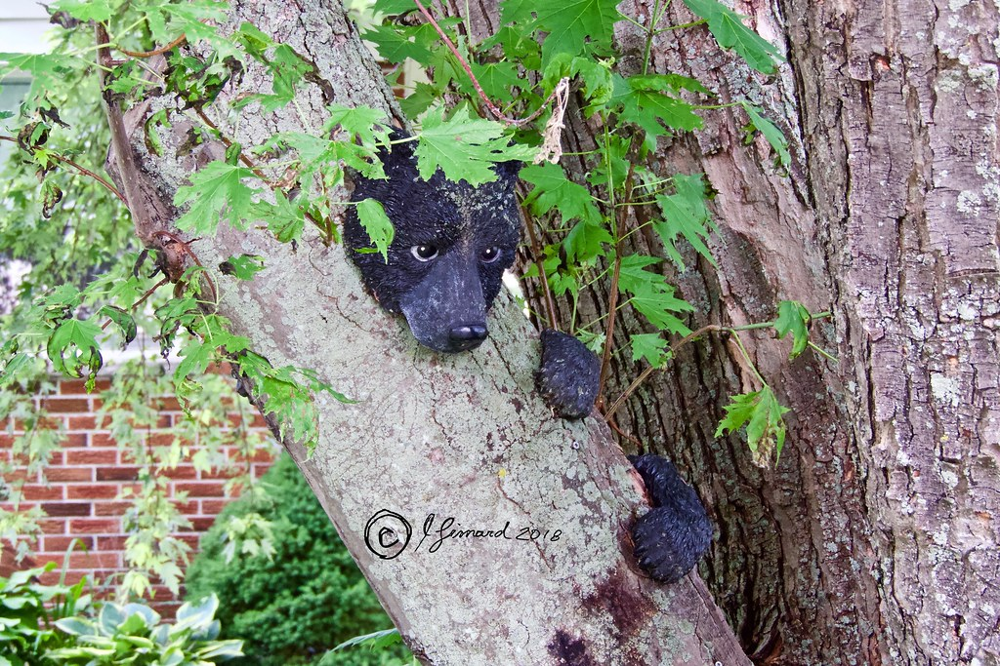
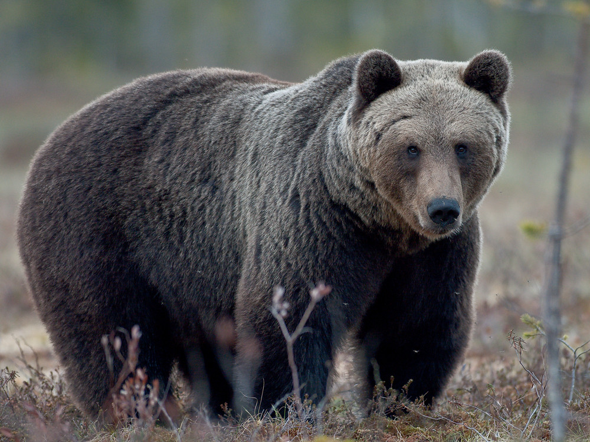
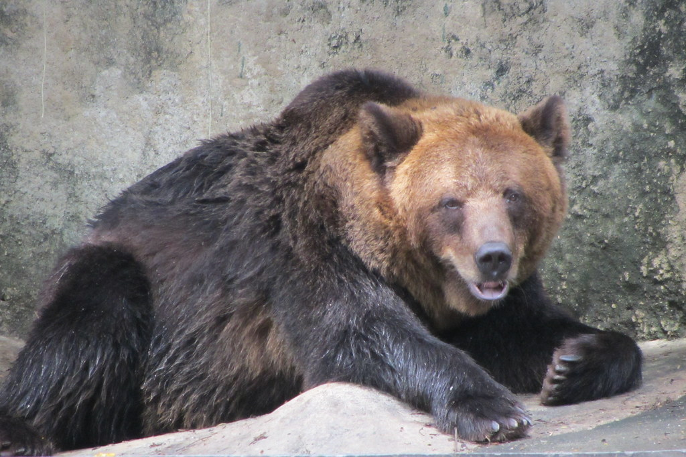

# 开放域少样本视觉分类比赛 - Boosted Vision-Language Model with Ensemble Adapters




## 简介

在人工智能的快速进展中，视觉语言模型已经成为计算机视觉领域的重要技术。这些模型在多任务处理上表现出色，显示出广泛的应用潜力。但是，在数据标注成本高昂的情况下，面对特定领域的挑战时，它们的表现还需提升。因此，如何在少量数据的支持下提高模型在特定领域的表现，已成为当下研究的热点问题。同时，使用少量数据增强多个领域上的表现，更具有挑战性。

因此，本赛题要求参赛者使用极少的多领域训练样本，探索在大模型时代下模型训练的创新策略，实现对多领域数据组成的测试集准确地分类。

本项目包含了 Niko Kawaii 队在第四届计图挑战赛计图 - 开放域少样本视觉分类比赛的代码实现。本项目的技术特征如下：
- **Boosting**: 我们从传统机器学习中的 Boosting 方法中借鉴了一些思想，提出了一种基于视觉-语言模型的集成学习方法。通过共享 Text Encoder 和 Image Encoder，我们轮流训练了多个 Adapter，然后将多个 Adapter 的输出进行融合，同时降低了 CLIP 推理时的 bias 和 variance。
- **Clustering-based Image Selection**: 我们提出了一种基于聚类的图像选择方法，通过聚类图像，我们可以选择出一些具有代表性的图像来进行模型的训练，从而降低了数据的噪声对模型的影响，提升了训练效果。
- **Prompt Engineering**: 我们参考了若干模型的生成结果，并进行了人工调整。通过 Prompt Engineering，我们可以获得更好的 Caption Representation。

我们同时设计了三种 Adapter 的类型，包括 `conv`, `mlp`, `attn`。我们的实验结果表明，`conv` 类型的 Adapter 在大多数情况下表现最好。我们认为，未来的研究可以进一步探索 Adapter 的设计和训练方法，以提高模型的性能。

**最终，我们的方案在 A 榜上取得了 `0.6915` 准确度的成绩，排名 `35`，入选决赛 B 榜。相比 baseline `0.5831` 准确度的成绩，有效准确度大约提升了10个百分点。**

## 安装

本项目可在 1 张 `TIRAN RTX` 上运行。使用默认超参数配置时，训练时间约为 40 分钟。

#### 运行环境

- ubuntu 20.04 LTS
- python >= 3.7
- jittor >= 1.3.8.5

#### 安装依赖

首先，创建一个新的 conda 环境：

```
conda create -n jittor python=3.7
conda activate jittor
```

然后，安装 jclip：

```
git clone https://github.com/uyzhang/JCLIP.git
cd JCLIP
pip install -e .
```

执行以下命令安装 python 依赖

```
pip install -r requirements.txt
```

#### 预训练模型

预训练模型模型下载地址为 [ViT-B-32.pkl](https://github.com/uyzhang/JCLIP/releases/download/%E6%9D%83%E9%87%8D/ViT-B-32.pkl)，下载后放入目录 `<root>/weights/` 下。

## 数据预处理

将 [TrainSet.zip](https://cloud.tsinghua.edu.cn/f/7c44b138a6344f4b8fd1/?dl=1) 和 [TestSetA.zip](https://cloud.tsinghua.edu.cn/f/c00ca0f3f27340899a05/?dl=1) 下载解压到 `<root>/data` 下，将 [classes.txt](https://cloud.tsinghua.edu.cn/f/418b311c5ae8484f8208/?dl=1) 和 [train.txt](https://cloud.tsinghua.edu.cn/f/212edd1e7b3b44f5b301/?dl=1) 下载到 `<root>/data` 下，执行以下命令对数据预处理：

```
python al_testset.py
```

### Prompt 生成方法

在对图像进行 Prompt 标注时，我们采用手动标注的方式。针对 `Animal` 和 `Caltech-101` 两类数据集，基本采用格式为 `a photo of (a) xxx, a type of xxx`，并加上一些对大部分图片性质的描述。例如：

- `a photo of Polar bear, a type of bear with white furs`
- `a photo of a menorah, a type of U-shaped furniture, usually with candles on it`

对于 `Food-101` 和 `Thu-dog` 两类数据集，采用统一的生成格式，分别为：

- `a food photo of xxx`
- `a dog photo of a xxx`

在 Prompt 生成过程中，我们使用了若干模型的生成方法并进行了手动微调。在训练数据上通过 zero-shot 方式进行 Prompt 效果的验证（`baseline_eval.py`）。综合考虑，上述的 Prompt 是在测试过的 Prompt 中总体质量最好的。相关 Prompt 的文件目录为 `./prompt/prompt4.csv`。**在运行之前，请将 prompt4.csv 文件复制到 `/data` 目录下**。后期测试和模型训练的 Prompt 保存在 data frame 的 `self_written_caption` 列中。测试集上的测试结果如下：

**Prompt 在完整训练集各类 zeroshot 的表现**

| 数据集       | Accuracy | 类别数/图片数    |
|--------------|----------|------------------|
| Animal       | 0.9212   | 52/4252          |
| Caltech-101  | 0.8454   | 91/7095          |
| Food-101     | 0.8087   | 101/100000       |
| Thu dog      | 0.4958   | 130/70432        |

### 图像选择方法

图像筛选采用系统聚类法。对每一个类中的所有图片使用原始 ViT-B-32 模型编码成向量，计算类中向量的汉明距离，并以 `ward` 聚类法进行系统聚类，得到每个类中最具代表性的4张图片。

使用以下命令运行筛选：

```bash
python al_testset.py
```

以bear 为例，我们将会得到：

<div style="display: flex;justify-content: center;">
    
     
</div>

<div style="display: flex;justify-content: center;">
    
     
</div>

生成的结果保存在`./data/selected_train3.txt`文件夹下。

## 训练

在训练时，trainer 将会依据参数配置，初始化一定数量的 adapter，随后迭代地对 adapter 进行训练。如果要开始训练，请运行 `adapter_boosting.py` 文件：

```
python adapter_boosting.py
```

该程序可以接受以下参数：

- `--training_batch_size`：训练时的 batch size，默认为 32
- `--eval_batch_size`：本地评估时的 batch size，默认为 256
- `--test_batch_size`：测试时的 batch size，默认为 256
- `--num_epochs`：训练的 epoch 数，默认为 50
- `--num_adapters`：Adapter 的数量，默认为 5
- `--learning_rate`：学习率，默认为 1
- `--adapter_type`：Adapter 的类型，默认为 `conv`，我们提供了 `mlp`, `attn`, `conv` 三种类型
- `--seed`：随机种子，默认为 0
- `--eval`：是否在训练时进行本地评估，默认为 `False`
- `--test`：是否生成测试集上的结果，默认为 `False`

## 推理

训练并同时生成测试集上的结果可以运行以下命令：

```
python adapter_boosting.py --test True
```

## 致谢

此项目基于论文 *CLIP-Adapter: Better Vision-Language Models with Feature Adapters* 改进实现。
